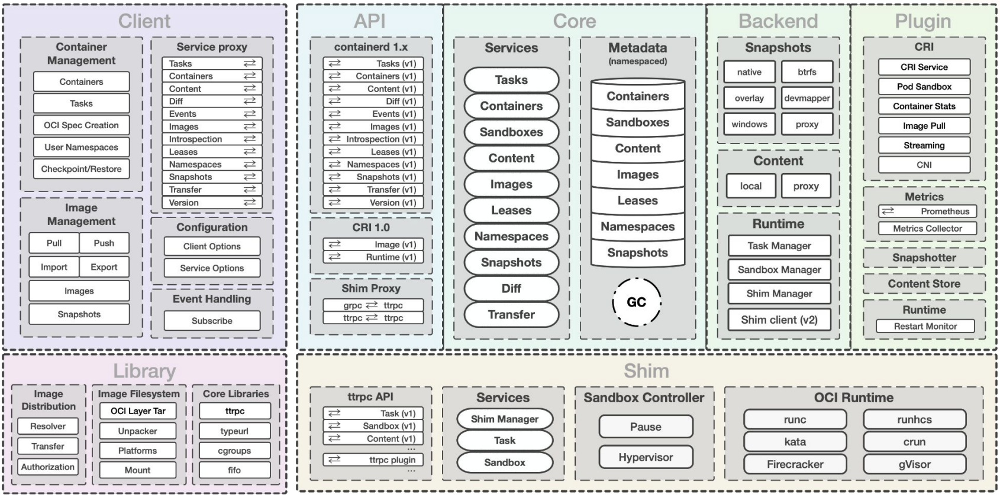

[원본링크](https://youtu.be/USmJ33jG0F4)

Kubecon Europe 2022

---

- Kubernetes 1.24 Stargazer
    - k8s  새로운 버전이 릴리즈 되었다는 이야기
    - 가장 큰 특이사항 Dockershim 이 kubelet 에서 제거되었다.
- containerd 를 위한 docker-compatible cli 인 nerdctl

---

### containerd 1.7 Beta

- Features Being Worked On
    - Sandbox service and API
    - Image Transfer Service
    - containerd API ↔ shim API proxy
    - NRIv2 using ttrpc
    - (preview) Network Service
    - (preview) Run Service
    - (preview) CRI plugin v2

---

### 개인 생각

- 다양한 이야기들이 나왔는데 내가 건진건 아래 archtiecture 그림([출처](https://static.sched.com/hosted_files/kccnceu2022/53/2022%20-%20Kubecon%20EU%20-%20containerd.pdf)) 과 nerdctl 라는 프로젝트가 있다는 것, ttrpc 라는 프로젝트가 있어 grpc 랑 호환이 되며 low-memory 에서 동작할 수 있도록 하고 있다 는 것이다.

- 
