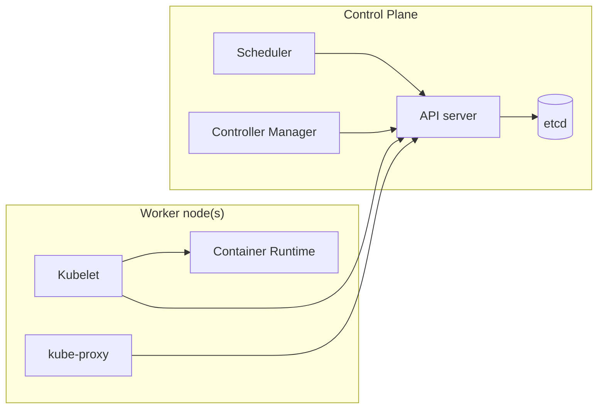

# Part 1. Overview
## Chapter 1. Introducing Kubernetes
### Changes of software development and deployments.
- Years ago, most software applications were big monoliths
  - Slow release cycles
  - Relatively infrequent updates
- Today, these applications are broken down into smaller. : microservices
  - Microservies are decoupled from each other -> Easily developed, deployed, updated, and scaled individually
- Kubernetes helps the ops team by automaticaly monitoring and rescheduling those apps in the event of a hardware failure.

### 1.1. Understanding the need for a system like Kubernetes
#### 1.1.1. Moving from monolithic apps to microservices
- Microservies communicate through synchronous protocols such as HTTP, over which they usually expose RESTful (REpresentional State Transfer) APIs, or through asynchronous protocols such as AMQP (Advanced Message Queueing Protocol)
- Scaling microservices
- Deploying microservices
- Understanding the divergence of environment requirements

#### 1.1.2. Providing a consistent environment to applications
#### 1.1.3. Moving to continuous delivery: DevOps and NoOps
- Understanding the benefits
- Letting developers and sysadmins do what they do best

### 1.2. Introducing container technologies
#### 1.2.1. Understanding what contianers are
- Isolating components with Linux container technologies
- Comparing virtual machines to containers
- Introducing the mechanisms that make container isolation possible
- Isolating processes with Linux Namespaces
- Limiting resources available to a process

#### 1.2.2. Intoducing the Docker container platform
- Understanding Docker concepts
  - Images
  - Regieries
  - Containers
- Building, distributing, and running a Docker image
- Comparing virtual machines and Docker containers
- Understanding image layers
- Understanding the portability limitations of container images

#### 1.2.3. Introducing rkt - an alternative to Docker
- rkt (pronounced "rock-it")
- benefits:
  - security
  - composability
  - conforming to open standards

### 1.3. Introducing Kubernetes
#### 1.3.1. Understanding its origins
- Through the years, Google developed an internal system called Borg

#### 1.3.2. Looking at Kubernetes from the top of a mountain
- Understanding the core of what Kubernetes does
- Helping deveopers focus on the core app features
- Helping ops teams achieve better reousrce utilization

#### 1.3.3. Understanding the architecture of a Kubernetes cluster
- The components that make up a Kubernetes cluster
  - The master node, which hosts the Kubernetes Control Plane that controls and manages the whole Kubernetes system
  - Worker nodes that run the actual applications you deploy

- The Control Plane
  - The Kubernetes API Server, which you and the other Control Plan components communicate with
  - The Schduler, which schedules your apps (assigns a worker node to each deployable component of your application)
  - The Controller Manager, which performs cluster-level functions, such as replicating components, keeping track of worker nodes, handlign node failures, and so on
  - etcd, a reliable distributed data store that persistently stores the cluster configuration.

- The nodes
  - Docker, rkt, or another container runtime, which runs your containers
  - The Kubelet, which talks to the API server and manages containers on its node.
  - The Kubernets Service Proxy (kube-proxy), which load-balances network traffic between application components

#### 1.3.4. Running an application in Kubernetes
- Understanding how the description results in a running container
- Keeping the containers running
- Scaling the number of copies
- Hitting a moving target

#### 1.3.5. Understanding the benefits of using Kubernetes
- Simplifying application deployment
- Achieving better unilization of hardware
- Health checking and self-healing
- Automatic scaling
- Simplifying application development

### 1.4. Summary
- Monolithic apps are easier to deploy, but harder to maintain over time and sometimes impossible to scale.
- Microservices-based application architectures allow easier development of each component, but are harder to deploy and configure to work as a single system.
- Linux containers provide much the same benefits as vitual machines, but are far more lightweight and allow for much better hardware utilization.
- Docker improved on existing Linux container technologies by allowing easier and faster provisioning of containerized apps together with their OS environments.
- Kubernetes exposes the whole datacenter as single computational reousrce for running applications.
- Developers can deploy apps through Kubernetes without assistance from sysadmins.
- Sysadmins can sleep better by having Kubernetes deal with failed nodes automatically.

## Chapter 2. First steps with Docker and Kubernetes
### 2.1. Creating, running, and sharing a container image
- docker run

```bash
docker run <image>:<tag>
```

- dockerfile
```dockerfile
FROM node:7
ADD app.js /app.js
ENTRYPOINT ["node", "app.js"]
```

- listing runnign containers
```bash
docker ps
```

- exploring the inside of a running container
```bash
docker exec -it <container-name> <command>
```
  - `-i`, which makes sure STDIN is kept open. You need this for entering commands into the shell.
  - `-t`, which allocates a pseudo terminal (TTY).

- Getting additional information about a container
```bash
docker inspect <container-name>
```

- The container's filesystem is also isolated
  - Tip: Entering a running container like this is useful when debugging an app running in acontainer. When something's wrong, the first thing you'll want to explore is the actual state of the system your application sees. Keep in mind that an application will not only see its own unique filesystem, but also processes, users, hostname, and network interfaces.

#### 2.1.7. Stopping and removing a container

```bash
docker rm <conatinaer-name>
```

#### 2.1.8. Pushing the image to an image registry
- Tagging an image under an additional tag
```bash
docker tag <image> <docker-hub-id>/<name>
```

```bash
docker images | head
```

- Pushing the image to Docker Hub
```bash
docker push <docker-hub-id>/<name>
```

- Running the image on a different machine

### 2.2. Setting up a Kubernetes cluster
#### 2.2.1. Running a local single-node Kubernetes cluster with Minikube
### 2.3. Running your first app on Kubernetes
#### 2.3.1 Deploying your app
```bash
kubectl run kubia --image=<image-name> --port=<port>
```

- Listing pods
```bash
kubectl get pods
```

#### 2.3.2. Accessing your web application
```bash
kubectl expose rc <pod-name> --type=LoadBalancer --name <service-name>
```

- Listing service
```bash
kubectl get services
```

```bash
kubectl get svc
```

#### 2.3.3. The logical parts of your system
- Understanding how the ReplicationController, the Pod, and the Service fit together
- Understanding the pod and its container
- Understanding the role of the ReplicationController
- Understanding why you need a service

#### 2.3.4. Horizontally scaling the application
- Increasing the desired replica count
```bash
kubectl scale rc <pod-name> --replicas=<number>
```

- Seeing the results of the scale-out
```bash
kubectl get rc
```

#### 2.3.5. Examining what nodes your app is running on
#### 2.3.6. Introducing the Kubernetes dashboard
### 2.4. Summary

# Part 2. Core concepts
## Chapter 3. Pods: running containers in Kubernetes
### 3.1. Intorducing pods
#### 3.1.1. Understanding why we need pods
- Understanding why multiple containers are better than one container running multiple processes

#### 3.1.2. Understanding pods
- Understanding the partial ioslation between containers of the same pod
- Understanding how containers share the same IP and port space
- Introducing the flat inter-pod network

#### 3.1.3. Organization containers across pods properly
- Splitting multi-tier apps into multiple pods
- Splitting into multiple pods to enable individual scaling
- Understanding when to use multiple containers in a pod
- Deciding when to use multiple containers in a pod

### 3.2. Creating pods from YAML or JSON descriptors
```bash
kubectl get po <podname> -o yaml
```

1. Kubernetes API version used in this YAML descriptor
2. Type of Kubernetes object/resource
3. Pod metadata(name, labels, annotations, and so on)
4. Pod specification/contents(list of pod's containers, volumes, and so on)
5. Detailed status of the pod and its containers
- Inducing the main parts of a pod definition:
  - Metadata includes the name, namespace, labels, and other information about the pod.
  - Spec contains the actual description of the pod's contents, such as the pod's containers, volumes, and other data.
  - Status contains the current information about the runnign pod, such as what condition the pod is in, the description and status of each container, and the pod's internal IP and other basic info.

#### 3.2.2. Creating a  simple YAML descriptor for a pod
- Specifying container ports
- Using kubectl explain to discover possible API object fields
```bash
kubectl explain pods
```

#### 3.2.3. Using kubectl create to create the pod
#### 3.2.4. Viewing application logs

```bash
kubectl logs <container id>
```

- Retrieving a pod's log with kubectl logs
- Specifying the container name when getting logs of a multi-container pod
```bash
kubectl logs <container id> -c <container-name>
```

#### 3.2.5. Sending requests to the pod
- Forwarding a local network port to a port in the pod
```bash
kubectl port-forward <container-id> 8888:8080
```

- Connecting to the pod through the port forwarder

### 3.3. Organizing pods with labels
#### 3.3.1. Introducing labels
- Each pod is labeled with two labels:
  - app, which specifies which app, component, or microservice the pod belongs to.
  - rel, which shows whether the application running in the pod is a stable, beta, or a canary release

- Definition : A canary relase is when you deploy a new version of an application next to the stable version, and only let a small fraction of users hit the new version to see how it behaves before rolling it out to all users. This prevents bad releases from being exposed to too many users.

#### 3.3.2. Specifying labels when creating a pod
#### 3.3.3. Modifying labels of existing pods
- Show labels pod
```bash
kubectl get po --show-labels
kubectl get po -L creation_method,env
```

```bash
kubectl label po <pod-name> creation_method=manual
```

### 3.4. Listing subsets of pods through label selectors
- A label selector can select resources based on whether the resource:
  - Contains (or doesn't contain) a label with a certain key
  - Contains a label with a certain key and value
  - Contains a label with a certain key, but with a value not equal to the one you specify

#### 3.4.1. Listing pods using a label selector
#### 3.4.2. Using multiple conditions in a label selector

### 3.5. Using labels and selectors to constrain pod scheduling
#### 3.5.1. Using labels for categorizing worker nodes

#### 3.5.2. Scheduling pods to specific nodes
#### 3.5.3. Scheduling to one specific node

### 3.6. Annotating pods
#### 3.6.1. Looking up an object's annotations
#### 3.6.2. Adding and modifying annotations

### 3.7. Using namespaces to group resources
#### 3.7.1. Understanding the need for namespaces
#### 3.7.2. Discovering other namespaces and their pods
#### 3.7.3. Creating a namespace
#### 3.7.4. Managing objects in other namespaces
#### 3.7.5. Understanding the isolation provided by namespaces
### 3.8. Stopping and removing pods
#### 3.8.1. Deleting a pod by name
#### 3.8.2. Deleting pods using label selectors

## Chapter 4. Replication and other controllers: deploying managed pods
### 4.1. Keeping pods healthy
#### 4.1.1. Introducing liveness probes
- Kubernetes can probe a container using one of the three mechanisms:
  - An HTTP GET probe performs an HTTP GET request on the container's IP address, a port and path you specify. If the probe receives a response, and the response code doesn't represent an error(in other words, if the HTTP response code is 2xx or 3xx), the probe is considered successful. If the server returns an error response code or if it doesn't respond at all, the probe is considered a failure and the container will be restarted as a result.
  - A TCP Socket probe tries to open a TCP connection to the specified port of the container. If the connection is established successfully, the probe is successful. Otherwise, the container is restarted.
  - An Exec probe excutes an arbitrary command inside the container and checks the command's exit status code. If the status code is o, the probe is successful. All other codes are considered failures.

#### 4.1.2. Creating an HTTP-based liveness probe
#### 4.1.3. Seeing a liveness probe in action
#### 4.1.4. Configuring addiontal properties of the liveness probe
#### 4.1.5. Creating effective liveness probes
- What a liveness probe should check:
  - Make sure the `/health` HTTP endpoint doesn't require authentication
- Keeping probes light
- Don't Border implementing retry loops in your probes
- Liveness probe wrap-up

### 4.2. Introducing ReplicationControllers
#### 4.2.1. The operation of a ReplicationController
- A ReplicationController has three essential parts:
  - A label selector, which determines what pods are in the ReplicationController's scope
  - A replica count, which specifies the desired number of pods that should be running
  - A pod template, which is used when creating new pod replicas
- Understanding the benefits of using a ReplicationController:
  - It makes sure a pod (or multiple pod replicas) is always running by starting a new pod when an existing one goes missing.
  - When a cluster node fails, it creates replacement replicas for all the pods that were running on the failed node (those that were under the Replication-Controller's control).
  - It enables easy horizontal scaling of pods - both manual and automatic
- A pod instance is nver relocated to another node. Instead, the ReplicationController creates a completely new pod instance that has no relation to the instance it's replacing.

#### 4.2.2. Creating a ReplicationController
- Don't specify a pod selector when defining a ReplicationController.

#### 4.2.3. Seeing the ReplicationController in action
- `rc` : replicationcontroller

```bash
kubectl get rc
```

#### 4.2.4. Moving pods in and out of the scope of a ReplicationController
- Although a pod isn't tied to a ReplicationController, the pod does reference it in the metadata.ownerReferences field, which you can use to easily find which ReplicationController a pod belongs to.

#### 4.2.5. Changing the pod template
```bash
kubectl edit rc <rc-name>
```

#### 4.2.6. Horizontally scaling pods
```bash
kubectl scale rc <rc-name> --replicas=<num>
```
#### 4.2.7. Deleting a ReplicationController
```bash
kubectl delete rc <rc-name>
```

### 4.3. Using ReplicaSets instead of ReplicationControllers
#### 4.3.1. Comparing a ReplicaSet to a ReplicationController
#### 4.3.2. Defining a ReplicaSet
#### 4.3.3. Creating and examing a ReplicaSet
```bash
kubectl get rs
```

#### 4.3.4. Using the ReplicaSet's more expressive label selectors
- Selector key matchExpressions' operators:
  - `In`-Label's value must match one of the specified values.
  - `NotIn`-Label's value must not match any of the specified values.
  - `Exists`-Pod must include a label with the specified key (the value isn't important). When using this operator, you shouldn't specify the values field.
  - `DoesNotExist`-Pod must not include a label with the spcified key.

#### 4.3.5. Wrapping up ReplicaSets
```bash
kubectl delete rs <rs-name>
```

### 4.4. Running exactly one pod on each node with DaemonSets
#### 4.4.1. Using a DaemonSet to run a pod one every node
#### 4.4.2. Using a DaemonSet to run pods only on certain nodes
- Creating the DaemonSet
- Adding the required label to your node(s)

### 4.5. Running pods that perform a single completable task
#### 4.5.1. Introducing the Job resource
#### 4.5.2. Defining a Job resource
#### 4.5.3. Seeing a Job run a pod
```bash
kubectl get jobs
```

#### 4.5.4. Running multiple pod instances in a Job
#### 4.5.5. Limiting the time allowed for a Job pod to complete

### 4.6. Scheduling Jobs to run periodically or once in the future
#### 4.6.1. Creating a CronJob
#### 4.6.2. Understanding how scheduled jobs are run
### 4.7. Summary
- You can specify a liveness probe to have Kubernetes restart your containre as soon as it's no longer healthy
- Pods shouldn't be created directly, because they will not be re-created if they're deleted by mistake, if the node they're running on fails, or if they're evicted from the node.
- ReplicationControllers always keep the desired number of pod replicas running
- Scaling pods horizontally is as easy as changing the desired replica count on a ReplicationController
- Pods aren't owned by the ReplicationControllers and can be moved between them if necessary.
- A ReplicationController creates new pods from a pod template. Chaning the template has no effect on existing pods.
- ReplicationControllers should be replaced with ReplicaSets and Deployments, which provide the same functionality, but with additional powerful features.
- ReplicationControllers and ReplicaSets schedule pods to random cluster nodes, whereas DaemonSets make sure every node runs a single instance of a pod defined in the DaemonSet.
- Pods that perform a batach task should be created through a Kubernetes Job resource, not directly or through a ReplicationController or similar object.
- Jobs that need to run sometime in the future can be created through CronJob resources.

## Chapter 5. Services: enabling clients to discover and talk to pods
### 5.1. Intoducing services
- When creating a service with multiple ports, you must speicify a name for each port.
- FQDN : fully qualified domain name

### 5.2. Connecting to services living outside the cluster

### 5.3. Expsing services to external clients
- Ways to make a service accisible externally:
  - Setting the service type to NodePort
  - Setting the service type to LoadBalancer
  - Creating an Ingress resource

### 5.4. Exposing services externally through an Ingress resource
### 5.5. Signaling when a pod is ready to accept connections
- three types of readiness probes:
  - An Exec probe, where a process is executed.
  - An HTTP GET probe
  - A TCP Socket probe
- If you want to add or remove a pod from a service manually, add enabled=true as a label to your pod and to the label selector of your service.
- You should always define a readiness probe, even if it's as simple as sending an HTTP requeset to the base URL.
- Don't include pod shutdown logic into your readiness probes

### 5.6. Using a headless service for discovering individual pods
### 5.7. Troubleshooting services
- Make sure you're connecting to the service's cluster IP from within the cluster, not from the outside.
- Don't bother pining the service IP to figure out if the service is accessible (remember, the service's cluster IP is a virtual IP and pining it will never work).
- If you've defined a readiness probe, make sure it's succeeding; otherwise the pod won't be part of the service.
- To confirm that a pod is part of the service, examine the corresponding Endpoints object with `kubectl get endpoints`.
- If you're trying to access the service through its FQDN or a part of it and it doesn't work, see if you can access it using its cluster IP instead of the FQDN.
- Check whether you're connecting to the port exposed by the service and not the targtet port.
- Try connecting to the pod IP directly to confirm your pod is accepting connections on the correct port.
- If you can't even access your app through the pod's IP, make sure your app isn't only binding to localhost.

### 5.8. Summary
- Expose multiple pods that match a certain label selector under a single, stable IP address and port.
- Make services accessible from inside the cluster by default, but allows your to make the service accessible from outside the cluster by setting its type to either `NodePort` or `LoadBalancer`
- Enables pods to discover services together with their IP addresses and ports by looking up environment variables
- Allows discovery of and communication with services residing outside the cluster by creating a Service resource without specifying a selector, by creating an associated Endpoints resource instead
- Provides a DNS CNAME alias for external services with the ExternalName service type
- Expose multiple HTTP services through a single Ingress (consuming a single IP)
- Uses a pod container's readiness probe to determine whether a pod should or shouldn't be included as a service endpoint
- Enables discovery of pod IPs through DNS when you create a headless service

## Chapter6. Volumes: attaching disk storage to containers
### 6.1. Introducing volumes
- volume types:
  - emptyDir : A simple empty directory used for storing transient data.
  - hostPath : Used for mounting directories from the worker node's filesystem into the pod
  - gitRepo : A volume initialized by checking out the contents of a Git repository
  - nfs : An NFS share mounted into the pod
  - gcePersistentDisk : Google Compute Engine Persistent Disk
  - cinder, cephfs, iscsi, flocker, glusterfs, guobyte, rdb, flexVolume, vsphere-Volume, photonPersistentDisk, scaleIO : Used for mounting other types of network storage
  - configMap, secret, downwardAPI : Special types of volumes used to expose certain Kubernetes resources and cluster information to the pod
  - persistentVolumeClaim : A way to use a pre- or dynamically provisioned persistent storage.

### 6.2. Using volumes to share data between containers
#### 6.2.1. Using an emptyDir volume
#### 6.2.2. Using a Git repository as the starting point for a volume

### 6.3. Accessing files on the worker node's filesystem
### 6.4. Using persistent storage
### 6.5. Decoupling pods from the underlying storage technology
#### 6.5.1. Introducing PersistentVolumes and PersistentVolumeClaims
#### 6.5.2. Creating a PersistentVolume
- pv : persistent volume
- pvc : persistent volume claim

### 6.6. Dynamic provisioning of PersistentVolumes
- Similar to PersistentVolumes, StorageClass resources aren't namespaced.

### 6.7. Summary
- Create a multi-container pod and have the pod's containers operate on the same files by adding a volume to the pod and mounting it in each container
- Use the emptyDir volume to store temporary, non-persistent data
- Use the gitRepo volume to easily populate a directory with the contents of a Git repository at pod startup
- Use the hostPath volume to access files from the host node
- Mount external storage in a volume to persist pod data across pod restarts
- Decouple the pod from the storage infrastructure by using PersistentVolumes and PersistentVolumeClaims
- Have PersistentVolumes of the desire (or the default) storage class dynamically provisioned for each PersistentVolumeClaim
- Prevent the dyanic provisioner from interfering when you want the PersistentVolumeClaim te be bound to a pre-provisioned PersistentVolume

## Chapter 7. ConfigMaps and Secrets: configuringg applications
### 7.1. Configuring containerized applications
### 7.2. Passing command-line arguments to containers
#### 7.2.1. Defining the command and arguments in Docker
- ENTRYPOINT defines the executable invoked when the container is started
- CMD specifies the arguments that get passed to the ENTRYPOINT

### 7.3. Setting environment variables for a container
### 7.4. Decoupling configuration with a ConfigMap
- ConfigMap keys must be a valid DNS subdomain (they may only contain alphanumeric characters, dashes, underscores, and dots). They may optionally include a leading dot.

### 7.5. Using Secrets to pass sensitive data to containers
### 7.6. Summary
- Override the default command defined in a container image in the pod definition
- Pass command-line arguments to the main container process
- Set environment variables for a container
- Decouple configuration from a pod specification and put it into a ConfigMap
- Store sensitive data in a Secret and deliver it securely to containers
- Create a docker-registry Scret and use it to pull images from a private image registry

## Chapter 8. Accessing pod metadata and other resources from applications
### 8.1. Passing metadata through the Downward API
### 8.2. Talking to the Kubernetes API server
```bash
kubectl cluster-info
```

- Accessing the API server through kubectl proxy
```bash
kubectl proxy
```

- How a pod's name, namespace, and other metadata can be exposed to the process either through enviroment variables or files in a downwardAPI volume
- How CPU and memory requests and limits are passed to your app in any unit the app requies
- How a pod can use downwardAPI volumes to get up-to-date metadata, which may change during the lifetime of the pod (such as labels and annotations)
- How you can brwose the Kubernetes REST API through kubectl proxy
- How pods can find the API server's location through environment variables or DNS, similar to any other Service defined in Kubernetes
- How an application running in a pod can verify that it's talking to the API server and how it can authenticate itself
- How using an ambassador container can make talking to the API server from within an app much simpler
- How client libraries can get you interacting with Kubernetes in minutes

## Chapter 9. Deployments: updating applications declaratively
### 9.1. Updating applications running in pods
### 9.2. Performing an automatic rolling update with a ReplicationController
### 9.3. Using Deployments for updating apps declaratively
- Deployment -> ReplicaSet -> Pods
- `kubectl edit`
- `kubectl patch`
- `kubectl apply`
- `kubectl replace`
- `kubectl set image`

### 9.4. Summary
- Perform a rolling update of pods managed by a ReplicationController
- Create Deployments instead of lower-level ReplicationControllers or ReplicaSets
- Update your pods by editing the pod template in the Deployment specification
- Roll back a Deployment either to the previous revision or to any earlier revision still listed in the revision history
- Abort a Deployment mid-way
- Pause a Deployment to inspect how a single instnace of the new version behaves in production before allowing additional pod instances to replace the old ones
- Control the rate of the rolling update through maxSurege and maxUnavailable properties
- Use minReadySeconds and readiness probes to have the rollout of a faulty version blocked automatically

- Use three dashes as a separator to define multiple resources in a single YAML file
- Turn on kubectl's verbose loggin to se exacyl what it's doing behind the curtains

## Chatper 10. StatefulSets: deploying replicated statful applications
- StatefulSets were initially called PetSets. That name comes from the pets vs. cattle analogy explained here
- SRV record
  ```bash
  kubectl run -it srvlookup --image/tutum/dnsutils --rm
  ```

### 10.6. Summary
- Give replicated pods individual storage
- Provide a stable identity to a pod
- Create a StatefulSet and a corresponding headless governing Service
- Scale and update a StatefulSet
- Discorver other members of the StatefulSet through DNS
- Connect to other members through their host names
- Forcibly delete stateful pods

# Part 3. Beyond the basics
## Chapter 11. Understanding Kubernetes internals
### 11.1 Understanding the architecture
- Kubernetes cluster is split into two parts:
  - The Kubernetes Control Plane
  - The (worker) nodes
- Components of the Control Plane:
  - The etcd distributed persistent storage
  - The API server
  - The Scheduler
  - The Controller Manager
- Components running on the worker nodes:
  - The Kubelet
  - The Kubernetes Service Proxy (kube-proxy)
  - The Container Runtime (Docker, rtc, or others)
- Add-on components:
  - The Kubernetes DNS server
  - The Dashboard
  - An Ingress controller
  - Heapster
  - The Container Network Interface newtork plugin

#### 11.1.1. The distribued natrue of Kubernetes components



