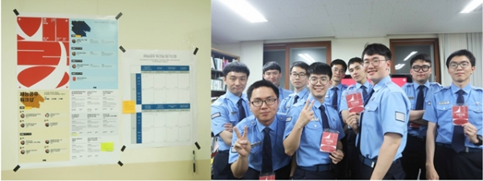
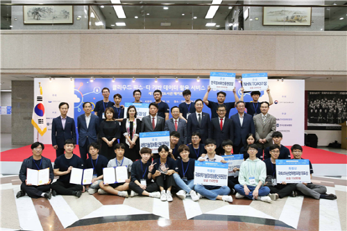
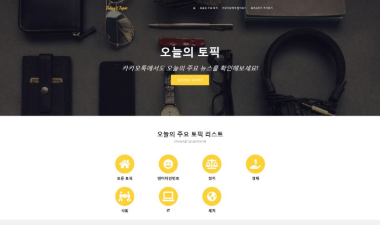
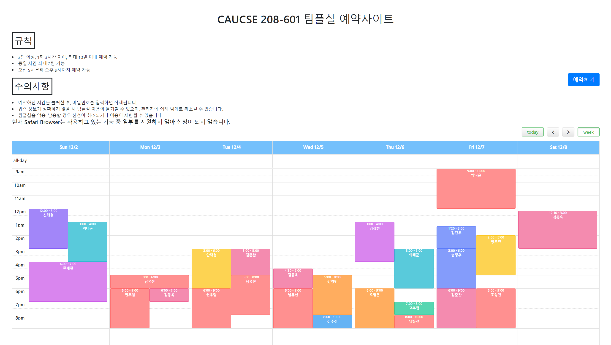
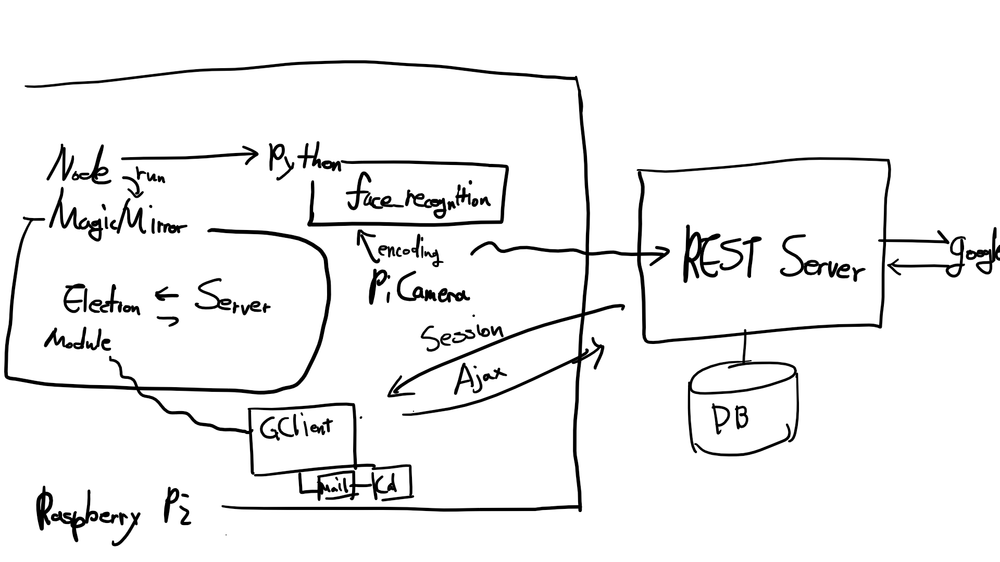
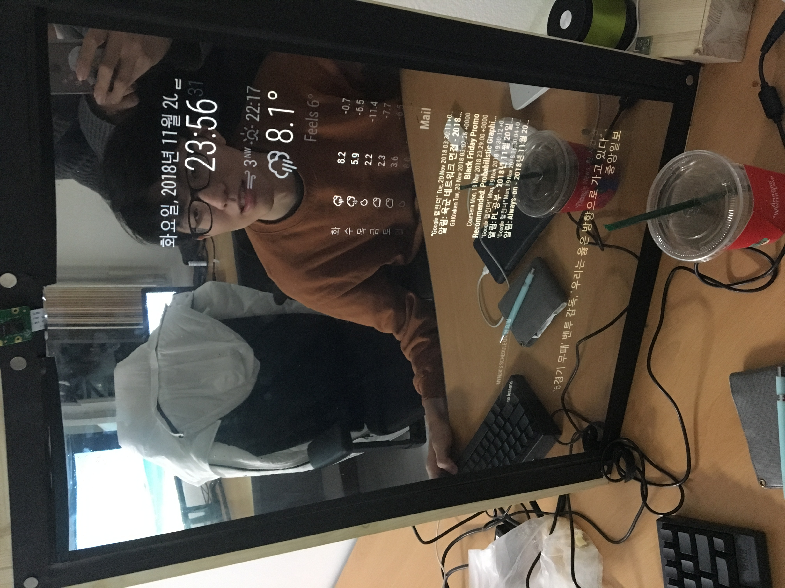
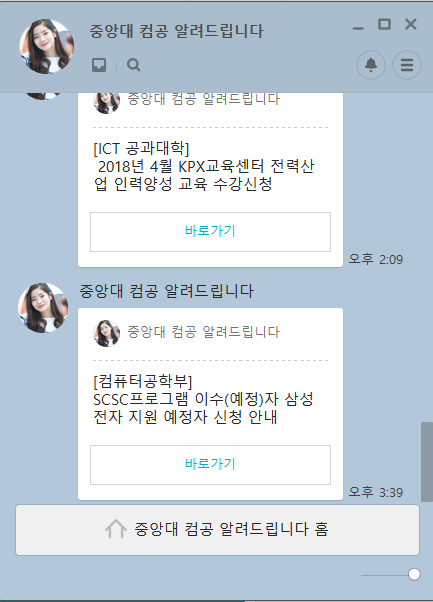
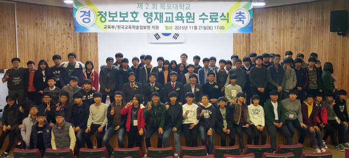

## Courses
 * 중앙대학교
 * 전공 : 컴퓨터공학부 소프트웨어 전공
 * 부전공 : 응용통계학과

## Projects
### 2021
#### 데이터베이스 백업 성능 향상을 위한 병렬 인덱스 스캔 기법
 * C++
 * MySQL 코드를 일부 수정해서 Table Full Scan 상황에서 Index를 사용한 병렬처리로 SSD 환경에서 속도 향상
 * 한국정보처리학회, 2021 추계학술발표대회 논문경진대회 항목 은상

#### 어덕행덕, 아이돌 짤 덕질 플렛폼
 * 2021 소프트웨어 마에스트로 12기
 * Java(Spring)
 * DHash와 BK-Tree를 사용해 사진 간 인덱싱
 * 쿼리 성능향상을 위해서 다중 서버 병렬처리
 * 쿼리 통신을 위해서 Kafka 사용
 * 코드는 소프트웨어 마에스트로 진행이 종료되면 공개

### 2019
#### IT Conference in compulsory military service (How does garbage collector work? - in javascript) (공군 정보체계관리단 IT동아리 계령 전산한마당)
 * [관련 기사 링크](http://www.dowori.co.kr/news/articleView.html?idxno=2919)
 * 
 * [위키 링크](/wiki/memory_leak)
#### Competition for Korean Thanksgiving day in compulsory military service (How to make Songpyeon) (추석 대회- 송편 만들기)
 * [위키 링크](/wiki/송편대회)
#### IT Conference in compulsory military service (Fxxking Query Language) (썩어버린 Query Language)
 * [위키 링크](/wiki/썩어버린-query-language)
#### Comptition for New Year in compulsory military service (What is New Year?) (설대회 - 설이란?)
 * [위키 링크](/wiki/설대회)

#### Paper Reading Study
 * [F2FS 위키링크](/wiki/f2fs)
 * [EXT4 위키링크](/wiki/ext4)
 * [Endurable Transient Inconsistency in Byte Addressable Persistent B+-Tree](/wiki/endurable_transient_inconsistency_in_byte_addressable_persistent_b+-tree)

### 2018
##### 2018.10 ~ 2019.02 : System and Storage Lab (mysql storage engine - innodb)
#### 2018.10 ~ 2018.11 Today's Topic (오늘의 토픽)
* 클라우드 파스-타 기반 데이터 활용 서비스 경진대회: 제1회 국회도서관 해커톤 대회 - 국회과학기술정보방송통신위원장상 (Korea Congrass Paas-TA Hackathon - Science and Technology Information Broadcasting Commission Chairman Award)

#### 2018.09 ~ 2018.12 CAUCSE TeamProject Reservation Web
[http://caucseteamproject.herokuapp.com/](http://caucseteamproject.herokuapp.com/)

#### 2018.04~2018.12 MCube (My Magic Mirror)

### 2017
#### 2017.08 ~ 2017.09 caucsescrape (slack notification chatbot, no screenshot)
#### 2017.09 ~ 2018.03 caucsenotice - 중앙대 컴공 알려드립니다.

- MCube is smart mirror project which recognized the face of the user and displays the user info(like email, news feed) from google or facebook and so on.
#### 2017 ACM-ICPC Daejeon Regional (Team : No Monk) - honorable mention(62nd)
 * [http://icpckorea.org/2017/regional/scoreboard/](http://icpckorea.org/2017/regional/scoreboard/)
##### 2017.10 ~ 2018.06 : Machine Intelligence Lab (Binary Flower Pollination Algorithm)
 * [CAU MI Lab](http://mi.cau.ac.kr/?f=activities)

### Others

#### 2015 ~ 2016 Security Academy in Mokpo Unniversity (Web Hacking, Digital Forensic) (목포대학교 정보보호 영재교육원 웹해킹, 포렌식 과정)

