# 추석을 맞아 송편을 창의적으로 출력하기 대회가 열렸다. 먼가 인공지능으로 가장 완벽한 송편을 출력해보고 싶어졌다.

## 0. Configuration

먼저 인공지능 스택으로 배운건 Tensorflow, Keras이기 때문에 언어는 편하게 모두 python으로 하기로 결정했다.

그렇게 언어를 정하고 과정을 다음과 같이 나눴다.

1. 송편 이미지 크롤링 하기
2. Keras를 통해 GAN모델을 구현해서 한번 테스트 해보기
3. 나온 결과를 확인하고 모델을 학습 데이터 특성에 맞춰서 재설계, 데이터 가공, 통계적으로 분석... 등등 원하는 결과를 내도록 설계

이렇게 정하고 나니 필요한 라이브러리는 다음과 같았다. `requests, beautifulsoup, tensorflow, keras, pandas`

최근에 `i3`로 환경을 재구축하다보니 재대로된 python 환경이 하나도 없어서 겸사겸사 아는분 ~~(양예비역님 떠나고 나서야 빛인줄 알았습니다.~~이 추천해준 anyenv 까지 설정해보기로 했습니다.

### anyenv 로 pyenv 설치

`git clone [https://github.com/anyenv/anyenv](https://github.com/anyenv/anyenv) ~/.anyenv`

`echo 'export PATH="$HOME/.anyenv/bin$PATH"' >> ~/.zshrc`

`echo 'eval "$(anyenv init -)"' >> ~/.zshrc`

anyenv를 다 깔았으니 pyenv를 깔자

`anyenv install pyenv`

근데 알아보니까 pyenv 는 pyenv-virtualenv plugin이 있으면 virtualenv 를 쉽게 할 수 있다고 한다.

`git clone git/git://github.com/yyuu/pyenv-virtualenv ~/.anyenv/envs/pyenv/plugins/pyenv-virtualenv`

`echo 'eval "$(pyenv virtualenv-init -)"' >> ~/.zshrc`

금방 다깔았다.

이제 pyenv 설정이 끝났다. workspace 폴더나 만들어주자

나는 `~/workspace/songpyeon` 에 구축했다.

이제 사용할 파이썬 버전을 깔아보자

`pyenv install 3.7.4`  를 해줘서 깔았다.

## 1. Keras Test

케라스로 한번 테스트 해보자. 흔하디 흔한 예제인 MNIST를 돌렸다.

[MNIST_test.pdf](MNIST_test.pdf)

잘 돌아간다. 코드는 다른 곳에서 적당히 찾아 붙였는데 그 과정에서 에러를 너무 많이 맞아서 수정하다보니 원본 블로그를 닫아버려서 링크를 못걸었다.

[MNIST test.ipynb](MNIST test.ipynb)

## 2. 송편 이미지 크롤링하기

- 단순히 request로만 크롤링하려고했는데 상위 20개 미리보기 이미지 밖에 안되서 서칭한다음 누군가 selenium 을 통해서 원본이미지 저장을 하는 라이브러리를 만들어놨다고 해서 가져다가 썻다.
- 코드에서는 10000개를 긁도록 되어있는데 어짜피 서피스에서는 러닝하기에는 많은양의 데이터가 쓸모가 없어서 대충 300개 근방에서 중단시켰다. 좋은 장비가 있으면 나중에 해볼만 할거 같다.

[scrapping_songpyeon_-_Jupyter_Notebook.pdf](scrapping_songpyeon_-_Jupyter_Notebook.pdf)

[scrapping_songpyeon.ipynb](scrapping_songpyeon.ipynb)

---

여기까지가 추석연휴 1일차(약 1시간 30분)간 진행됬다. 추석연휴에는 놀아야 하므로 여기까지

## 3. 송편 이미지 학습시키기

간단하게 잘 돌아가는지 체크하기 위해섯 128x128 이미지로 해봤다.

[songpyeon_generator.ipynb](songpyeon_generator.ipynb)

[songpyeon_generator.pdf](songpyeon_generator.pdf)

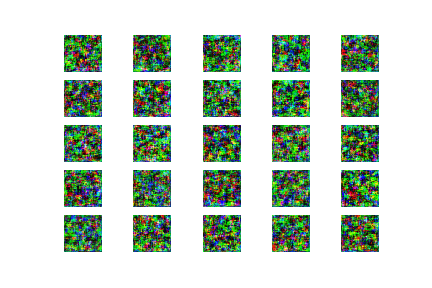
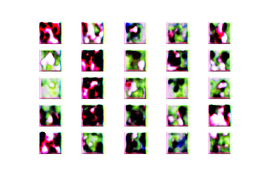
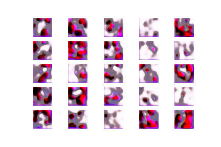
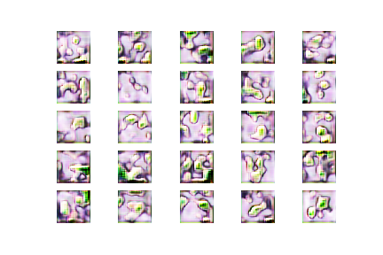
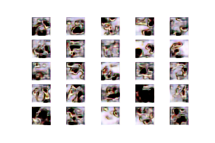
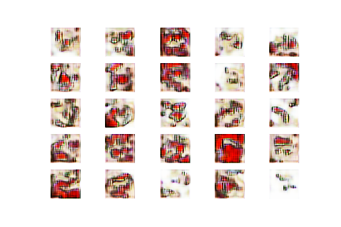
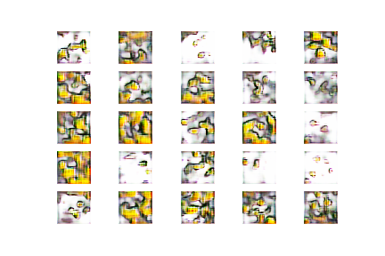

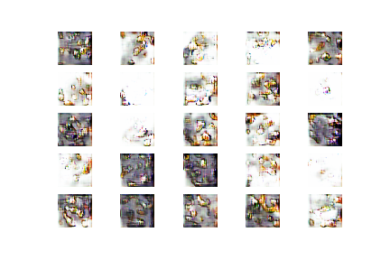
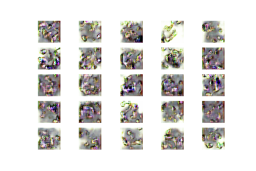
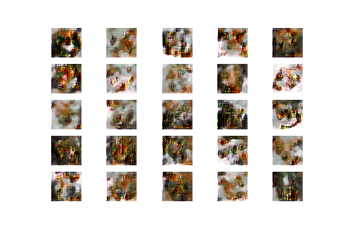

흐음? 나도 못알아보는 이미지를 계속 뱉는다. ㅠ 300까지는 괜찮았던거 같은데

이미지 해상도를 높여보자

## 4. 해상도 높여서 다시 학습??

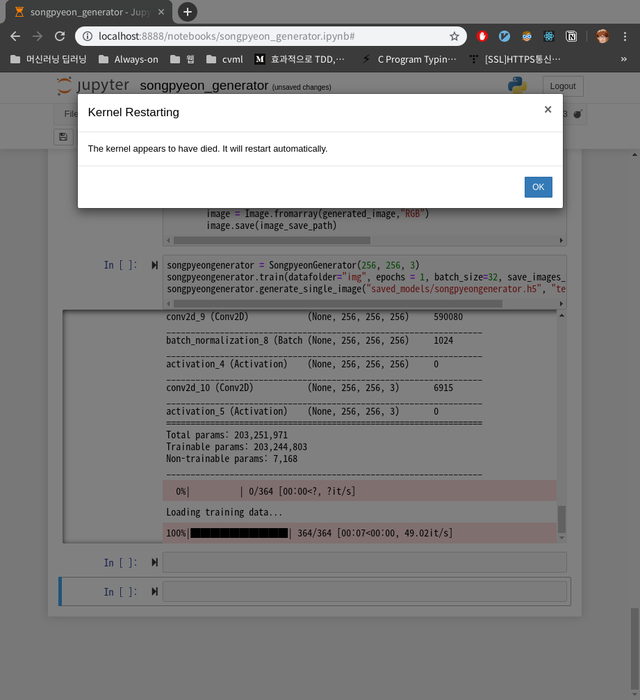

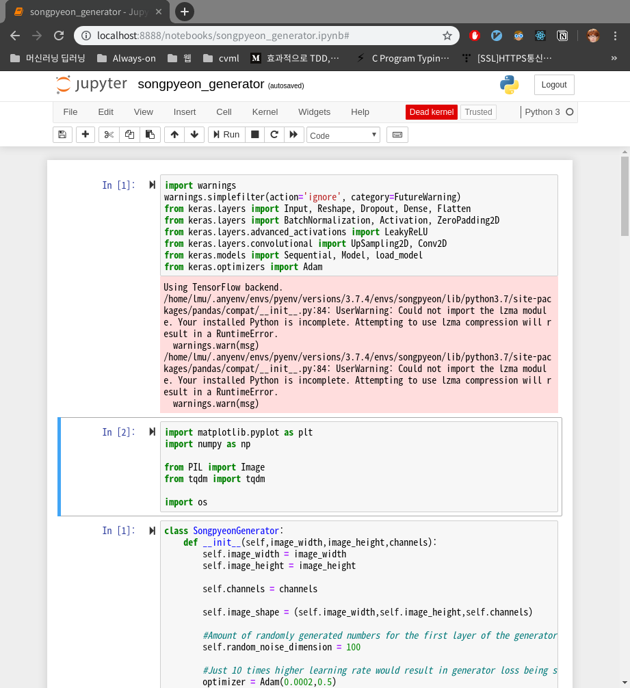

8GB 짜리 장비에선 안돌아간다 ㅠ

AWS에서 돌릴까 싶었으나... 돈들이긴 아쉬워 여기까지 진행했다.

## 5. Summary

- 생각보다 시간이 적게걸렸다. 코드 짜는데는 총 2시간
- CPU에서 러닝시키지 말자 - 3시간 학습돌렸는데 저모양이다.
- 머신러닝은 장비가 좋아야되나보다
